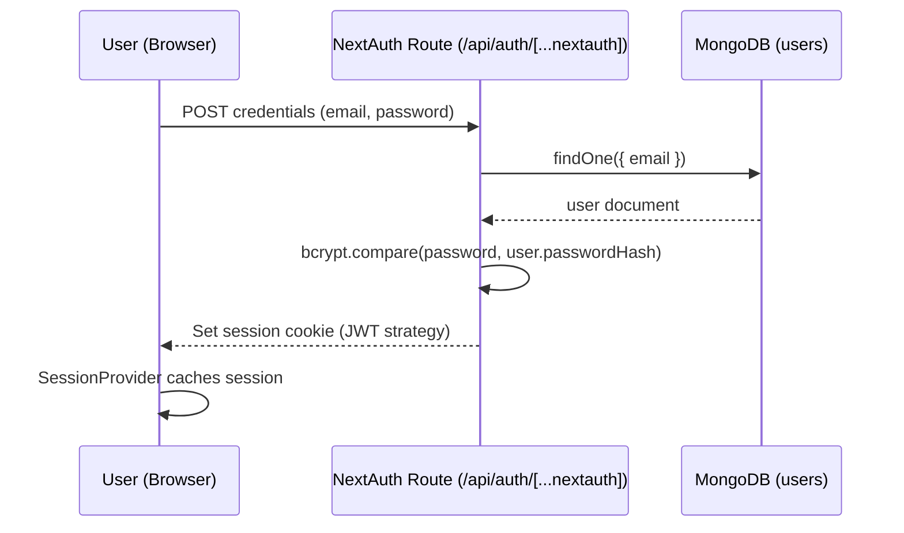
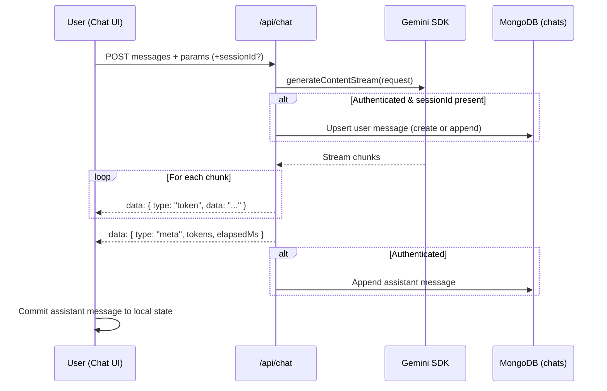
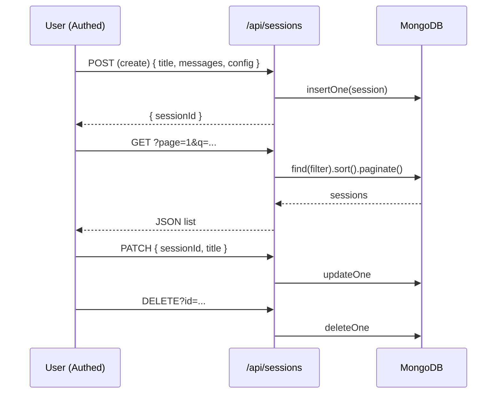

# Gemini Chatbot – Project Architecture & Technical Guide

> Comprehensive documentation of the system design, data flow, runtime behaviors, and extension points.

---
## 1. Overview
This project is a teaching-oriented Generative AI chat sandbox built with **Next.js (App Router)**. It demonstrates:
- Secure server-side model invocation (Google Gemini) with streaming.
- Adjustable sampling parameters (temperature, top‑p, max tokens).
- Real-time token streaming and lightweight latency metrics.
- Authenticated persistence of chat sessions (MongoDB + NextAuth credentials provider).
- Minimal, approachable code footprint for classroom or workshop settings.

The code intentionally prioritizes clarity over advanced optimization or production hardening.

---
## 2. High-Level Architecture
```
+------------------+        +------------------------------+        +------------------------+
| Browser (React)  |  POST  |  Next.js Route Handlers      |  SDK   |  Google Gemini API     |
|  - Chat UI       +------->+  /api/chat (stream gateway)  +------->+  (generateContentStream)|
|  - Auth pages    |        |  /api/auth/* (NextAuth)      |        +------------------------+
|  - Session mgmt  |        |  /api/sessions CRUD          |
+--------+---------+        |                              |        +------------------------+
         ^                  |  lib/ai/gemini.ts            |        |  MongoDB Atlas          |
         |   JSON/SSE       |  lib/db.ts (Mongo client)    +<------>+  chats / users          |
         |                  |  lib/auth.ts (authOptions)   |        +------------------------+
         |                  +------------------------------+
         |  Persisted state (after auth)
         +-----------------------------------------------> Stored Chat Sessions
```

---
## 3. Core Responsibilities
| Layer | Responsibility |
|-------|----------------|
| UI (Client) | Collect user input, render messages incrementally, manage parameter state, invoke API endpoints. |
| Route Handlers | Validate input, enforce auth, orchestrate persistence, call Gemini SDK, stream results. |
| AI Adapter (`lib/ai/gemini.ts`) | Encapsulate Gemini client creation and prompt construction. |
| Persistence (`lib/db.ts`) | Provide singleton Mongo connection + typed collections. |
| Auth (`lib/auth.ts`) | Configure NextAuth credential flow and JWT/session mapping. |
| Types (`lib/types.ts`) | Shared TypeScript contracts for messages, configs, sessions, envelopes. |

---
## 4. Detailed Request Lifecycles
### 4.1 Login (Credentials)


### 4.2 Chat Message Streaming


### 4.3 Session CRUD


---
## 5. Data Model Summary
| Entity | Key Fields | Notes |
|--------|------------|-------|
| ChatMessage | role, content | System, user, assistant roles (plain text). |
| StoredChatSession | sessionId, title, messages[], model, temperature, topP, maxTokens, userId, createdAt, updatedAt | Messages array holds full transcript. |
| AppUser | userId, email (unique), passwordHash, timestamps | Credentials provider only (no OAuth). |

---
## 6. Important Files
| Path | Purpose |
|------|---------|
| `src/app/components/Chat.tsx` | Streaming UI + session management. |
| `src/app/api/chat/route.ts` | Streaming gateway to Gemini. |
| `src/lib/ai/gemini.ts` | Server-only Gemini helper (centralizes API key). |
| `src/app/api/sessions/*.ts` | CRUD endpoints for saved chats. |
| `src/lib/db.ts` | Mongo client + collection helpers + indexes. |
| `src/lib/auth.ts` | NextAuth credential provider + JWT/session callbacks. |

---
## 7. Environment Variables
| Variable | Required | Description |
|----------|----------|-------------|
| `GEMINI_API_KEY` | Yes | Google Gemini API key (server only). |
| `MONGODB_URI` | Yes (when persistence enabled) | Connection string for MongoDB. |
| `MONGODB_DB` | No | Overrides default DB name `gemini_chatbot`. |
| `NEXTAUTH_SECRET` | Yes (auth) | Secret for signing NextAuth JWT. |
| `NEXTAUTH_URL` | Yes | Base URL for callbacks. |

Security Note: Ensure `.env.local` is in `.gitignore` (do not commit real secrets).

---
## 8. Streaming Implementation Details
- Uses `ReadableStream` in Route Handler to emit lines with `data:` prefix (SSE-like convention).
- Client reads `ReadableStreamDefaultReader`, splits by newlines, parses JSON envelopes.
- Envelope types: `token`, `meta`, `error`.
- Token counting is approximate (per chunk) for instructional simplicity.

Potential Enhancements:
- Use true token counts from model metadata (if available).
- Switch to official `EventSource` protocol with proper `Content-Type: text/event-stream` (already set) and id/retry fields for robustness.
- Add backpressure / timeout handling.

---
## 9. Authentication Flow
- Credentials provider only: email + password.
- Passwords hashed with `bcryptjs` (salt rounds = 10).
- JWT strategy keeps sessions stateless (no DB session table).
- User ID inserted into JWT (`token.uid`) → surfaced in `session.user.id`.
- Authorization checks: all `/api/sessions*` endpoints require active session.
- `/api/chat` does not strictly require auth, but persistence logic only runs when user is logged in and provides a sessionId.

---
## 10. Persistence Strategy
- Entire transcript stored as an array on the `chats` document (simplifies retrieval for small demos).
- Indexes: `updatedAt` (sorting), `email` (unique on users), `createdAt` on chats.
- Sessions listed with projection excluding `messages` for lighter listing payloads.
- Scaling Consideration: For large histories, switch to separate `messages` collection or pagination.

---
## 11. State Management (Client)
- React local state only (no Redux/Zustand) for pedagogical transparency.
- Config persisted in `localStorage` (`genai-config`).
- Session list fetched on filter/page changes; optimistic UI when creating new session.
- Streaming state tracked via `pending` assistant object separate from committed `messages`.

---
## 12. Error Handling & Resilience
| Area | Strategy | Improvement Ideas |
|------|----------|------------------|
| Input Validation | Basic presence checks (model, messages) | Add schema validation (zod). |
| Streaming Errors | Emits `error` envelope then closes stream | Distinguish network vs model errors; show retry UI. |
| Persistence Failures | Logged to console; streaming continues | Surface non-blocking toast to user. |
| Auth | 401 responses on protected endpoints | Centralize with helper to reduce duplication. |

---
## 13. Security Considerations
Current Safeguards:
- Server-only API key usage (never sent to client).
- Hashing of user passwords with bcrypt.
- Limitation of stored data to chat text (no PII encouraged).
- Minimal safety setting in Gemini request (harassment threshold). 

Recommended Hardening for Production:
- Add rate limiting (e.g., token bucket keyed by user/IP) to `/api/chat`.
- Add content moderation (pre + post) and logging/auditing.
- Enforce stricter password policies (length, complexity, lockouts).
- CSRF protection (NextAuth helps; ensure proper cookie settings in production).
- Secrets management via platform environment (Vercel, etc.).

---
## 14. Performance Notes
- Single Mongo client reused across hot reloads.
- Chat messages appended incrementally to reduce race conditions (user message pre-stream, assistant message post-stream).
- Parameter controls and metrics rendered conditionally to keep repaint cheap.
- Light UI (no heavy component libraries) keeps bundle size small.

Potential Optimizations:
- Debounce session search queries.
- Adopt Suspense + streaming Server Components for initial session load.
- Use `Edge` runtime for low-latency streaming if SDK compatibility permits.

---
## 15. Extensibility Roadmap
| Feature | Approach |
|---------|----------|
| Function Calling / Tools | Introduce schema for tool requests; intercept model output for JSON commands. |
| RAG (Retrieval-Augmented Generation) | Add vector store + retrieval step before call; inject context into system or user prompt. |
| Multi-modal Input | Expand UI to upload images/audio; use Gemini multi-modal endpoints. |
| Fine-grained Metrics | Track per-chunk timing, bytes, tokens; display charts. |
| Role-based Access | Extend user schema with roles; gate features (e.g., advanced models). |
| Billing / Quotas | Add usage counters per user; enforce monthly limits. |

---
## 16. Testing Strategy (Suggested)
Currently minimal. Suggested layering:
1. Unit: prompt builder, auth callbacks (mock DB).
2. Integration: `/api/chat` stream contract (simulate request, parse events).
3. E2E: Login → create session → send message → see streamed response.

Tools: Playwright (E2E), Vitest/Jest (unit), supertest (route handlers via Next test harness).

---
## 17. Deployment Notes
- Set all env vars in hosting provider (e.g., Vercel Project Settings).
- Ensure `NEXTAUTH_URL` matches deployed domain (https with correct host).
- Configure MongoDB Atlas network access for deployment regions.
- Optionally enable logging/observability (OpenTelemetry, Axiom, or DataDog) for streaming performance metrics.

---
## 18. Known Limitations
| Limitation | Impact |
|-----------|--------|
| Approx token metric | Educational only, not billing-grade data. |
| Monolithic chat document | Growth may exceed document size if chats become very long. |
| Minimal safety settings | Potential for undesired output; rely on Gemini defaults. |
| No rate limiting | Abuse risk in open environments. |
| Single factor auth | No MFA / password recovery flow. |

---
## 19. Quick Start Recap
```bash
npm install
# create .env.local with GEMINI_API_KEY, MONGODB_URI, NEXTAUTH_SECRET, NEXTAUTH_URL
npm run dev
# open http://localhost:3000
```
Register → Login → Open Chat → Adjust parameters → Send prompt → Observe streaming.

---
## 20. Glossary
| Term | Definition |
|------|------------|
| Temperature | Randomness scaler for token sampling (higher = more diverse). |
| Top‑P (nucleus) | Samples from smallest token set whose cumulative probability ≥ p. |
| Token | Smallest textual unit in model processing (approx; chunks in demo). |
| Streaming | Incremental emission of generated text for lower perceived latency. |

---
## 21. Maintenance Tips
- Keep `lib/ai/gemini.ts` the only place where the model client is instantiated.
- When adding new models, gate them in a shared constant and validate on server.
- Use migrations or TTL indexes if adding ephemeral content (e.g., ephemeral sessions).
- Regularly prune abandoned sessions to keep collection slim.

---
## 22. Suggested Next Commits
1. Add `.env.example` reflecting full variable set (if missing).
2. Integrate zod validation for API payloads.
3. Implement rate limiting middleware.
4. Add Jest/Vitest unit tests for `streamGemini` and session CRUD.
5. Introduce a system prompt editor for instructors.

---
## 23. Credits
Created as a learning scaffold. Adapt and extend responsibly.

---
**End of Document**
